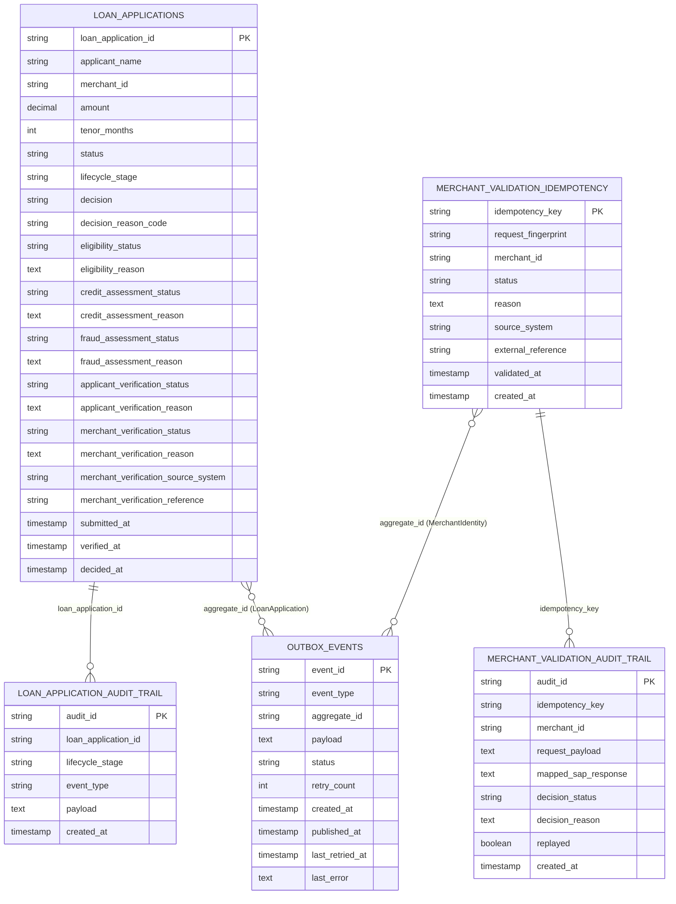

# ERD

This ERD reflects the persisted tables currently defined by JPA entities in the project.

## Notes

- Physical foreign keys are not declared in the entity mappings; relationships above are logical/application-level links.
- `outbox_events.aggregate_id` is polymorphic and stores IDs from different aggregates (for example `loan_application_id` and `merchant_id`).
